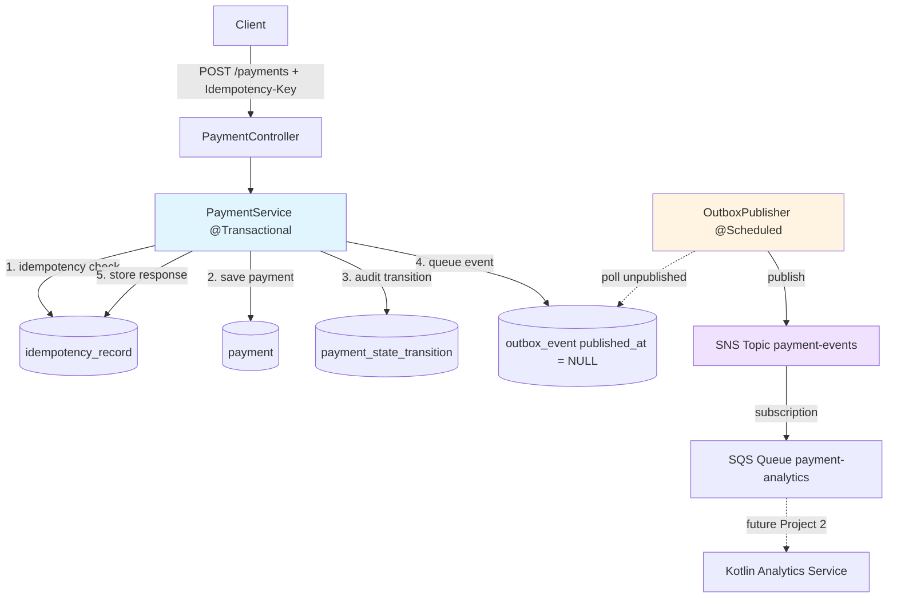

# NovaPay Payment Platform

[](https://github.com/belberdai/novapay-platform/actions/workflows/ci.yml)


A payment processing service. Demonstrates idempotency at the database layer, a 
state machine on the Payment entity, the transactional outbox pattern, and event-
driven communication via SNS/SQS.

> **Status:** Project 1 (payment-service) complete. Project 2 (Kotlin
> analytics service consuming events) in progress.

---

## Architecture


All five DB writes happen in one `@Transactional` method. Either everything
commits or nothing does. No scenario produces a payment without its outbox event,
or an event without the matching payment row.
---

## Quick start

You'll need: Docker Desktop, Java 25, Maven (or use the included wrapper).

```bash
# 1. Bring up Postgres + LocalStack
docker compose -f infra/docker-compose.yml up -d

# 2. Run the service
cd services/payment-service
./mvnw spring-boot:run

# 3. Create two test accounts (one-time)
docker exec payment-postgres psql -U payment_user -d payments -c \
  "INSERT INTO payment.account (account_number, currency) VALUES ('ACC-001', 'CAD') RETURNING id;"
docker exec payment-postgres psql -U payment_user -d payments -c \
  "INSERT INTO payment.account (account_number, currency) VALUES ('ACC-002', 'CAD') RETURNING id;"

# 4. Create a payment (replace UUIDs with your real ones from step 3)
curl -X POST http://localhost:8080/api/v1/payments \
  -H "Content-Type: application/json" \
  -H "Idempotency-Key: demo-001" \
  -d '{
    "sourceAccountId": "<paste-account-1-id>",
    "destinationAccountId": "<paste-account-2-id>",
    "amountCents": 1500,
    "currency": "CAD",
    "description": "First payment"
  }'
```

---

## Key features

### Idempotent payment creation

Every `POST /payments` requires an `Idempotency-Key` header. The contract:

| Scenario | Response                                                |
|---|---------------------------------------------------------|
| New key | 201 with new payment                                    |
| Same key, same body | 201 with the **same** payment (no duplicate processing) |
| Same key, different body | 422 (Unprocessable Entity)           |
| Missing key | 400                                                     |

The atomicity guarantee comes from making the idempotency key the primary key
of the `idempotency_record` table. Postgres enforces the uniqueness constraint
at the storage layer, so simultaneous inserts with the same key can't both
succeed.

### State machine on the domain entity

`Payment` carries its own state-machine rules:

```
PENDING → VALIDATED → PROCESSING → COMPLETED
   ↓          ↓            ↓
   └──────────┴────────────┴─────────→ FAILED
```

Each transition is a behavior method on the entity (`validate()`,
`markProcessing()`, `complete()`, `fail()`). The methods enforce
preconditions; callers can't bypass the rules with `setStatus()` because
there is no setter. Every state change appends a row to
`payment_state_transition`.

### Transactional outbox pattern

Events aren't published to SNS directly. Instead, a row is inserted into the
`outbox_event` table in the same transaction that updates the payment. A
background poller (`OutboxPublisher`) reads unpublished events and pushes
them to SNS, marking them sent.

This solves the dual-write problem. You can't atomically write to Postgres and 
publish to SNS, but you can write to Postgres and an outbox row in the same 
transaction. The poller handles the rest. Delivery is at-least-once; consumers 
must be idempotent.

### Testing

- **Unit tests** (`PaymentStateMachineTest`) — every transition path and
  every illegal-transition rejection. Pure Java, no Spring, runs in
  milliseconds.
- **Integration tests** (`PaymentServiceIntegrationTest`) — full service
  flow against a real Postgres via Testcontainers. Validates that the
  multi-table writes commit atomically and that database constraints fire
  correctly.

---

## API

| Method | Endpoint | Purpose |
|---|---|---|
| `POST` | `/api/v1/payments` | Create a payment (requires `Idempotency-Key` header) |
| `GET` | `/api/v1/payments/{id}` | Get one payment |
| `GET` | `/api/v1/payments` | List payments (paginated) |

Error responses follow a structured shape:

```json
{
  "code": "idempotency_mismatch",
  "message": "Idempotency key 'demo-001' was previously used with a different request body",
  "details": null,
  "timestamp": "2026-05-15T10:23:45Z"
}
```

Status codes are mapped via `@RestControllerAdvice`:

| Exception | Status | Code |
|---|---|---|
| `PaymentNotFoundException` | 404 | `payment_not_found` |
| `IdempotencyMismatchException` | 422 | `idempotency_mismatch` |
| `IllegalPaymentStateTransition` | 409 | `illegal_state_transition` |
| `DataIntegrityViolationException` | 409 | `conflict` |
| Missing required header | 400 | `missing_header` |
| Malformed JSON or bad path UUID | 400 | `malformed_request` / `invalid_parameter` |
| Validation failure on body | 400 | `validation_failed` |

---

## Project structure

```
.
├── infra/
│   ├── docker-compose.yml         # Postgres 18 + LocalStack (SNS/SQS/DynamoDB)
│   ├── postgres-init/             # Schema bootstrap
│   └── localstack-init/           # AWS resources bootstrap
├── services/
│   └── payment-service/
│       └── src/main/java/dev/novapay/payments/
│           ├── account/           # Account aggregate
│           ├── payment/           # Payment aggregate + state machine + REST
│           ├── idempotency/       # Fingerprinting + record storage
│           ├── outbox/            # Outbox event + scheduled publisher
│           └── config/            # Clock, ObjectMapper, SnsClient beans
└── .github/workflows/             # CI: build + test on every push
```

Code is organized **by feature**, not by technical layer. Each feature folder
contains the entity, repository, service, and (where applicable) controller
for one concern.

---

## Interesting parts of the code

If you're skimming, these are the files worth opening:

- [**`Payment.java`**](services/payment-service/src/main/java/dev/novapay/payments/payment/Payment.java)
  — state machine on the entity. The behavior methods (`validate()`,
  `markProcessing()`, `complete()`, `fail()`) enforce transitions and update
  timestamps. No `setStatus()` exists.

- [**`PaymentService.java`**](services/payment-service/src/main/java/dev/novapay/payments/payment/PaymentService.java)
  — the atomic `@Transactional` method that does the multi-table write. 
  `createPayment()` does five things in one transaction: idempotency check, 
  payment insert, audit row, outbox event, idempotency record.

- [**`OutboxEventRepository.java`**](services/payment-service/src/main/java/dev/novapay/payments/outbox/OutboxEventRepository.java)
  — `SELECT … FOR UPDATE` over unpublished rows, ordered by ID. The
  pessimistic lock supports parallel poller instances.

- [**`OutboxPublisher.java`**](services/payment-service/src/main/java/dev/novapay/payments/outbox/OutboxPublisher.java)
  — the scheduled poller. Reads unpublished events, publishes to SNS, marks
  them sent. Hibernate dirty-tracking writes back the timestamp at commit.

- [**`GlobalExceptionHandler.java`**](services/payment-service/src/main/java/dev/novapay/payments/payment/GlobalExceptionHandler.java)
  — `@RestControllerAdvice` translating domain exceptions to HTTP responses.
  The catch-all `Exception` handler logs the stack trace before returning
  500, so unhandled exception types are debuggable.

---

## Technology choices

| Decision | Reason |
|---|---|
| Java 25 + Spring Boot 4 | Current versions; what I'd pick for a new project today |
| Postgres 18 | Constraints (UNIQUE, CHECK, FK) enforce correctness at the DB layer |
| LocalStack | Lets the AWS-bound code run locally |
| Flyway, not Hibernate DDL | Flyway owns the schema. Hibernate just validates it on startup |
| Plain UUID FKs, not `@ManyToOne` | Explicit fetches. No accidental lazy loads from JPA associations |
| `ddl-auto: validate` | Catches column-type mismatches before code runs |
| Records for DTOs (immutable). Hand-written entities so the state machine has somewhere to live | Records cover the immutable cases; entities need behavior |
| Two events (created + state-changed) | Creation and state change are different operations |

---

## Roadmap

Deliberately scoped out of v1, listed here so the cuts are honest:

- **AWS deployment** (ECS + RDS + real SNS/SQS) — coming next weekend.
- **Outbox poison-message handling** — `publish_attempts` counter with a
  max-retry cap. Right now, a permanently broken event would block the
  batch on every cycle.
- **Distributed tracing** — OpenTelemetry across services. Wired but not
  exporting; will add a collector with Project 2.
- **Account management endpoints** — accounts are seeded via SQL right
  now. Real applications would have a separate account service.
- **Authentication** — endpoints are unprotected. v2 would add API keys
  with per-account rate limits.
- **Project 2 — Kotlin analytics service** consuming the events this
  service publishes, with coroutine-based message processing, windowed
  aggregations in DynamoDB, and rule-based anomaly detection.

---

## License

MIT — see [LICENSE](LICENSE).