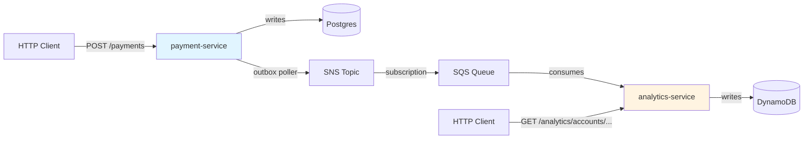

# NovaPay Payment Platform

[](https://github.com/belberdai/novapay/actions/workflows/ci.yaml)


An event-driven payment platform: a Java payment service publishes events
to SNS, a Kotlin analytics service consumes them and maintains a queryable
read model. Built to demonstrate idempotency at the database layer, the
transactional outbox pattern, atomic counter updates in DynamoDB, and
at-least-once-safe event processing.

> **Services:**
> - [payment-service](services/payment-service) — Java, Spring Boot, Postgres
> - [analytics-service](services/analytics-service) — Kotlin, Spring Boot, DynamoDB

---

## Development Methodology

This project was built as a technical upskilling exercise to deepen my
experience with distributed systems patterns. The architecture was
developed through iterative collaboration with Claude by Anthropic.

- **Architectural prototyping:** Patterns like the transactional outbox,
  database-level idempotency, and the domain state machine were
  developed through trade-off discussions and rapid iteration.
- **Engineering ownership:** AI assisted with proposing structural
  options and accelerating boilerplate. Every design decision was
  critically evaluated, refactored, and analyzed for production viability.

---

## Architecture



The two services are deliberately decoupled. Payment-service is the
source of truth for transactions; analytics-service is an eventually-
consistent read model. Analytics can be down without affecting payment
creation. Each service's README has its internal architecture diagram.

---

## Quick start

Prerequisites: Docker Desktop, Java 25.

```bash
# Bring up Postgres + LocalStack (SNS, SQS, DynamoDB)
docker compose -f infra/docker-compose.yml up -d

# Run the payment service (terminal 1)
cd services/payment-service
./mvnw spring-boot:run

# Run the analytics service (terminal 2)
cd services/analytics-service
./gradlew bootRun
```

Payment service listens on port 8080; analytics on 8081.

The [Bruno collection](http/novapay/) has ready-to-run requests for both.

---

## Project structure

```
.
├── infra/
│   ├── docker-compose.yml         # Postgres 18 + LocalStack
│   ├── postgres-init/             # Schema bootstrap for payment-service
│   └── localstack-init/           # SNS/SQS/DynamoDB resources
├── services/
│   ├── payment-service/           # Java / Spring Boot / Postgres
│   │   └── README.md              # ← service-specific docs
│   └── analytics-service/         # Kotlin / Spring Boot / DynamoDB
│       └── README.md              # ← service-specific docs
├── http/novapay/                  # Bruno HTTP test collection
└── .github/workflows/             # CI for both services
```

---

## Roadmap

Scoped out of v1 — listed honestly so the cuts are explicit:

- **PaymentStateChangedEvent end-to-end** — the event type is defined and
  published by the outbox poller, but the payment lifecycle endpoints
  (validate/process/complete/fail) aren't exposed via HTTP, and the analytics
  consumer doesn't handle it. Adding both sides is a natural follow-on.

- **Distributed tracing** — OpenTelemetry hooks are wired into the Spring
  Boot configuration but disabled. A real collector setup (Jaeger or Tempo)
  with trace propagation through SNS attributes would close the observability gap.

- **Authentication** — endpoints are unprotected. Production would require
  API keys or OAuth, rate limiting per principal, and account-level
  authorization on the payment endpoints.

- **Horizontal scaling** — both services are single-instance. Postgres has
  no read replicas. DynamoDB scales automatically but the consumer is a
  single SQS poller. Production sharding/scaling is the next architectural
  layer up.

---

## License

MIT — see [LICENSE](LICENSE).