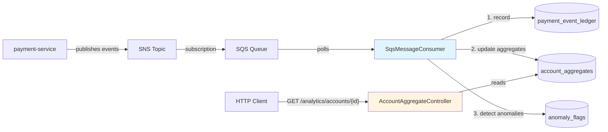

# NovaPay Analytics Service
← Back to [platform overview](../../README.md)


Event-driven analytics service written in Kotlin and consuming payment events from the payment
service. Maintains a per-account rollup view in DynamoDB and detects
velocity anomalies as events arrive. Pairs with [payment-service](../payment-service). Together they form the
two halves of an event-driven payment platform.

---

## Architecture



The consumer is the heart of the service. For each event consumed it does
three things in sequence: record to the append-only ledger, increment the
account aggregates atomically, and run anomaly rules. Failures of step 3
don't block step 2; failures of step 2 do, because the ledger conditional
write is also the deduplication mechanism.

---

## Key features

### At-least-once-safe event processing

SQS guarantees at-least-once delivery, not exactly-once. A consumer crash
between processing and message deletion will cause SQS to redeliver the
same event. The ledger absorbs the redelivery via a conditional
`PutItem` keyed on `(paymentId, occurredAt)` — the second insert fails
with `ConditionalCheckFailedException`, and the consumer skips the
aggregate updates. Same atomicity principle as the payment service's
idempotency: the database enforces the invariant, not application code.

### Atomic counter updates in DynamoDB

Each event affects two accounts — the source (debit) and the destination
(credit). Both updates use DynamoDB's `ADD` expression, which performs
the increment server-side in a single atomic operation. No
read-modify-write, no lost updates, no application-level locking.

### Rule-based anomaly detection

Anomaly detection is observational, not enforcement. Each event runs
through the anomaly rules after the aggregates update; triggered rules
write a row to the `anomaly_flags` table. The flag is a signal for
downstream review systems — the event itself is still processed normally.

Current rules:
- `VELOCITY_THRESHOLD_EXCEEDED` — fires when an account's
  `transactionsSent` exceeds a configurable threshold (default 5).

---

## Tech stack

| Choice | Reason |
|---|---|
| Kotlin 2.3 | First-class coroutines, idiomatic for I/O-bound work; smaller code than the Java equivalent |
| Gradle (Kotlin DSL) | Standard build tool for Kotlin projects |
| Spring Boot 4 / WebMVC | Same shape as payment-service; coroutines via `runBlocking` at the boundaries |
| AWS SDK for Kotlin | Native suspend-function APIs, not Java SDK wrapped |
| DynamoDB | Atomic counter primitives via `ADD` expressions; partition-key access patterns fit per-account lookups |
| LocalStack | Local SNS/SQS/DynamoDB without an AWS bill |
| Testcontainers + JUnit 5 | Real LocalStack instance per test run; same testing philosophy as payment-service |

---

## Quick start

Prerequisites: Docker Desktop, Java 25.

```bash
# From the repo root
docker compose -f infra/docker-compose.yml up -d

# Make sure payment-service is also running (separate terminal)
cd services/payment-service
./mvnw spring-boot:run

# In another terminal, run the analytics service
cd services/analytics-service
./gradlew bootRun
```

The service starts on port 8081 (payment-service owns 8080). Within a few
seconds of the service starting, the SQS consumer begins polling. Create
a payment in payment-service and watch it flow through:

```bash
# Trigger an event (using Bruno or curl)
curl -X POST http://localhost:8080/api/v1/payments \
  -H "Content-Type: application/json" \
  -H "Idempotency-Key: demo-001" \
  -d '{ "sourceAccountId": "...", "destinationAccountId": "...", "amountCents": 1500, "currency": "CAD" }'

# Wait a few seconds, then query the analytics
curl http://localhost:8081/analytics/accounts/<source-account-id>
```

The Bruno collection in `http/novapay/` has ready-to-run requests for
both services.

---

## API

| Method | Endpoint | Purpose |
|---|---|---|
| `GET` | `/analytics/accounts/{accountId}` | Per-account rollup metrics |
| `GET` | `/actuator/health` | Health check |

Example response:

```json
{
  "accountId": "d6f566c3-a7a7-49bc-8478-25f425ce6738",
  "transactionsSent": 6,
  "transactionsReceived": 0,
  "totalCentsSent": 9000,
  "totalCentsReceived": 0,
  "lastActivityAt": "2026-05-22T15:35:53.713Z"
}
```

Error responses follow the same shape as payment-service:

```json
{
  "code": "account_not_found",
  "message": "No analytics data found for account: ...",
  "timestamp": "2026-05-22T15:30:00Z"
}
```

| Exception | Status | Code |
|---|---|---|
| Account has no recorded events | 404 | `account_not_found` |
| Malformed UUID in path | 400 | `invalid_parameter` |

---

## Storage schema

Three DynamoDB tables, each with a distinct purpose:

### `payment_event_ledger` (append-only event log)

| Attribute | Type | Role |
|---|---|---|
| `paymentId` | String | Partition key |
| `occurredAt` | String (ISO timestamp) | Sort key |
| `eventType`, `sourceAccountId`, `destinationAccountId`, `amountCents`, `currency`, `status` | — | Event payload |

Conditional write on `(paymentId, occurredAt)` prevents duplicates.

### `account_aggregates` (per-account rollup)

| Attribute | Type | Role |
|---|---|---|
| `accountId` | String | Partition key |
| `transactionsSent`, `transactionsReceived` | Number | Counters (atomic ADD) |
| `totalCentsSent`, `totalCentsReceived` | Number | Counters (atomic ADD) |
| `lastActivityAt` | String | Last event timestamp |

### `anomaly_flags` (detection results)

| Attribute | Type | Role |
|---|---|---|
| `accountId` | String | Partition key |
| `flaggedAt` | String (ISO timestamp) | Sort key |
| `anomalyType`, `triggerPaymentId`, `details` | — | Flag metadata |

---

## Testing

Run the integration test suite:

```bash
./gradlew test
```

Tests use Testcontainers to spin up a real LocalStack instance with
DynamoDB and SQS. The AWS SDK code paths are exercised end-to-end against
a real (containerized) AWS API — not mocks. First run is slow due to
image pull; subsequent runs complete in ~1 minute.

Coverage includes:
- Ledger conditional dedup (rejects duplicate `paymentId + occurredAt`)
- Aggregate atomic counters (sum across multiple events)
- HTTP controller (200 with body, 404 missing, 400 malformed)

---

## Interesting parts of the code

- [**`SqsMessageConsumer.kt`**](src/main/kotlin/dev/novapay/analytics/consumer/SqsMessageConsumer.kt)
  — the scheduled poller. Deserializes JSON into a `data class`,
  records to ledger, updates aggregates, runs anomaly detection, deletes
  the SQS message. The `runBlocking` bridges Spring's scheduling thread
  to the suspending AWS SDK calls.

- [**`PaymentEventLedgerRepository.kt`**](src/main/kotlin/dev/novapay/analytics/ledger/PaymentEventLedgerRepository.kt)
  — the conditional `PutItem` is the deduplication mechanism.
  `ConditionalCheckFailedException` becomes "we've seen this event,
  return false."

- [**`AccountAggregateRepository.kt`**](src/main/kotlin/dev/novapay/analytics/aggregation/AccountAggregateRepository.kt)
  — the `ADD` expression handling. Each event updates two rows (source
  and destination) with atomic increments. No transaction needed because
  DynamoDB's ADD is itself atomic.

- [**`AnomalyDetector.kt`**](src/main/kotlin/dev/novapay/analytics/anomaly/AnomalyDetector.kt)
  — single-rule for now; structured to allow more rules without changing
  the consumer.

---

## Roadmap

Deferred from this version, listed honestly so the cuts are explicit:

- **PaymentStateChangedEvent end-to-end** — the event type and the
  payment lifecycle methods exist in payment-service, but no HTTP
  endpoint triggers them, so the events don't fire in practice.
  Completing this would require lifecycle endpoints on payment-service
  plus consumer-side handling here.

- **TransactWriteItems for cross-row atomicity** — currently
  ledger-then-aggregate is two separate writes. A partial failure
  between them could leave under-counted aggregates. Wrapping the
  ledger write and aggregate updates in a single transaction would
  close that gap, at 2x DynamoDB cost.

- **End-to-end consumer tests** — current integration tests exercise
  each component against LocalStack. The SQS → consumer → ledger →
  aggregate pipeline isn't tested end-to-end; would require publishing
  test messages to SQS and asserting the downstream state.

- **Additional anomaly rules** — current velocity rule is one of
  several defensible signals. Future rules might add amount thresholds,
  off-hours detection, geographic outliers.

- **Time-windowed aggregates** — current counters are lifetime totals.
  Sliding-window aggregates (last 1m, last 5m, last 1h) would enable
  richer anomaly detection.