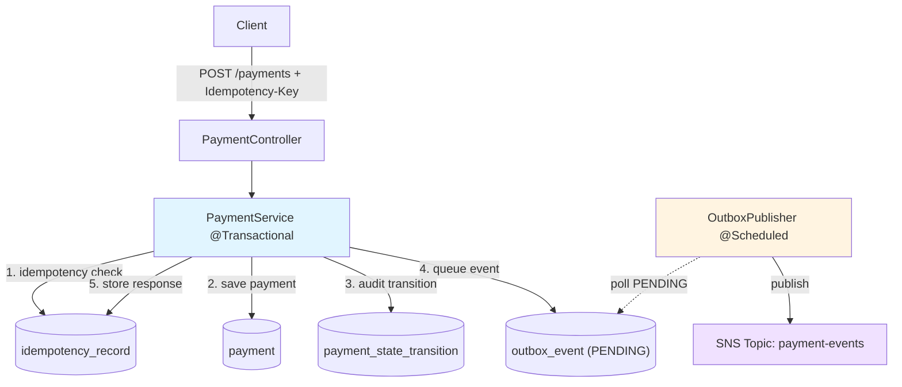

# NovaPay Payment Service
← Back to [platform overview](../../README.md)

The Java half of the NovaPay platform. Spring Boot 4 + Postgres 18 +
Flyway. Publishes payment events to SNS via the transactional outbox
pattern. Pairs with [analytics-service](../analytics-service). Together they form the
two halves of an event-driven payment platform.

---

## Architecture



All five DB writes happen in one `@Transactional` method. Either
everything commits or nothing does. No scenario produces a payment
without its outbox event, or an event without the matching payment row.

---

## Key features

### Idempotent payment creation

Every `POST /payments` requires an `Idempotency-Key` header. The contract:

| Scenario | Response |
|---|---|
| New key | 201 with new payment |
| Same key, same body | 201 with the **same** payment (no duplicate processing) |
| Same key, different body | 422 (Unprocessable Entity) |
| Missing key | 400 |

The atomicity guarantee comes from making the idempotency key the primary
key of the `idempotency_record` table. Postgres enforces the uniqueness
constraint at the storage layer, so simultaneous inserts with the same
key can't both succeed.

### State machine on the domain entity

`Payment` carries its own state-machine rules:

```
PENDING → VALIDATED → PROCESSING → COMPLETED
   ↓          ↓            ↓
   └──────────┴────────────┴─────────→ FAILED
```

Each transition is a behavior method on the entity (`validate()`,
`markProcessing()`, `complete()`, `fail()`). The methods enforce
preconditions; callers can't bypass the rules with `setStatus()` because
there is no setter. Every state change appends a row to
`payment_state_transition`.

### Transactional outbox pattern

Events aren't published to SNS directly. Instead, a row is inserted into
the `outbox_event` table in the same transaction that updates the
payment. A background poller (`OutboxPublisher`) reads `PENDING` events
and publishes them to SNS, marking them `PUBLISHED`.

This solves the dual-write problem. You can't atomically write to Postgres
and publish to SNS, but you can write to Postgres and an outbox row in the
same transaction. The poller handles the rest. Delivery is at-least-once;
consumers must be idempotent.

### Poison-message handling

Outbox events that fail to publish accumulate an attempt counter. After
5 attempts, the event is marked `POISONED` and skipped by future poll
cycles. Per-event try/catch isolates failures — one bad event doesn't
abort the batch. Operators can re-queue a poisoned event by setting its
status back to `PENDING`.

### Virtual threads enabled

Java 25 + Spring Boot 4's `spring.threads.virtual.enabled=true` swaps
the request thread pool to virtual threads. The service is I/O-bound
(DB writes, outbox publishing) so the traditional one-OS-thread-per-
request model leaves throughput on the table.

---

## API

| Method | Endpoint | Purpose |
|---|---|---|
| `POST` | `/api/v1/payments` | Create a payment (requires `Idempotency-Key` header) |
| `GET` | `/api/v1/payments/{id}` | Get one payment |
| `GET` | `/api/v1/payments` | List payments (paginated) |

Error responses follow a structured shape:

```json
{
  "code": "idempotency_mismatch",
  "message": "Idempotency key 'demo-001' was previously used with a different request body",
  "details": null,
  "timestamp": "2026-05-15T10:23:45Z"
}
```

Status codes are mapped via `@RestControllerAdvice`:

| Exception | Status | Code |
|---|---|---|
| `PaymentNotFoundException` | 404 | `payment_not_found` |
| `IdempotencyMismatchException` | 422 | `idempotency_mismatch` |
| `IllegalPaymentStateTransition` | 409 | `illegal_state_transition` |
| `DataIntegrityViolationException` | 409 | `conflict` |
| Missing required header | 400 | `missing_header` |
| Malformed JSON or bad path UUID | 400 | `malformed_request` / `invalid_parameter` |
| Validation failure on body | 400 | `validation_failed` |

---

## Quick start

Prerequisites: Docker Desktop, Java 25, the included Maven wrapper.

```bash
# From the repo root
docker compose -f infra/docker-compose.yml up -d

# Run the service
cd services/payment-service
./mvnw spring-boot:run

# One-time: create two test accounts
docker exec payment-postgres psql -U payment_user -d payments -c \
  "INSERT INTO payment.account (account_number, currency) VALUES ('ACC-001', 'CAD') RETURNING id;"
docker exec payment-postgres psql -U payment_user -d payments -c \
  "INSERT INTO payment.account (account_number, currency) VALUES ('ACC-002', 'CAD') RETURNING id;"

# Create a payment
curl -X POST http://localhost:8080/api/v1/payments \
  -H "Content-Type: application/json" \
  -H "Idempotency-Key: demo-001" \
  -d '{
    "sourceAccountId": "<paste-account-1-id>",
    "destinationAccountId": "<paste-account-2-id>",
    "amountCents": 1500,
    "currency": "CAD",
    "description": "First payment"
  }'
```

---

## Testing

```bash
./mvnw test
```

- **Unit tests** (`PaymentStateMachineTest`) — every transition path and
  every illegal-transition rejection. Pure Java, no Spring, runs in
  milliseconds.
- **Integration tests** (`PaymentServiceIntegrationTest`) — full service
  flow against a real Postgres via Testcontainers. Asserts on row content,
  not just presence. Includes outbox publisher state-transition tests with
  `@MockitoBean SnsEventPublisher`.

---

## Interesting parts of the code

- [**`Payment.java`**](src/main/java/dev/novapay/payments/payment/Payment.java)
  — state machine on the entity. No `setStatus()` exists.
- [**`PaymentService.java`**](src/main/java/dev/novapay/payments/payment/PaymentService.java)
  — the atomic `@Transactional` method that does the multi-table write.
- [**`OutboxPublisher.java`**](src/main/java/dev/novapay/payments/outbox/OutboxPublisher.java)
  — scheduled poller with per-event failure isolation and poison-message
  handling.
- [**`GlobalExceptionHandler.java`**](src/main/java/dev/novapay/payments/payment/GlobalExceptionHandler.java)
  — boundary translation between domain exceptions and HTTP responses.

---

## Technology choices

| Decision | Reason |
|---|---|
| Java 25 + Spring Boot 4 | Current versions; what I'd pick for a new project today |
| Postgres 18 | DB-layer constraints (UNIQUE, CHECK, FK) enforce correctness |
| Flyway, not Hibernate DDL | Flyway owns the schema; Hibernate validates it on startup |
| Plain UUID FKs, not `@ManyToOne` | Explicit fetches. No accidental lazy loads from JPA associations |
| `ddl-auto: validate` | Catches column-type mismatches before code runs |
| Records for DTOs, hand-written entities | Records cover immutable cases; entities need behavior |
| Status column, not nullable timestamps | Explicit `OutboxEventStatus` enum + CHECK constraint over null-encoded state |
| Virtual threads | I/O-bound workload; one-line config change |  